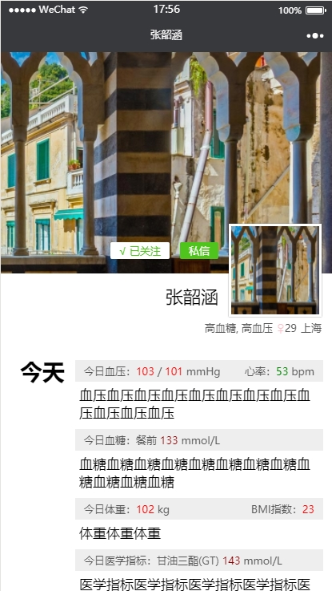

## wepy框架中的坑

- 不支持vue中scoped标记，如果添加scoped前缀，会报错。下面是错误示例：
```html
/*wrong usage*/
<style lang="less" scoped> 
</style>
```
- computed属性无法双向绑定到子组件，这个[ISSUE](https://github.com/wepyjs/wepy/issues/300)中说已经解决了，但是经我测试依然不能用sync传到子组件中。
- wepy的组件列表渲染有重大bug，repeat渲染时，父组件的props无法正常传到子组件里[待复现]
- 深层子组件发生更改，无法引起项目的重新编译，或者说错误信息不会重新报一遍？

## 开发中遇到的问题

- 如何获取用户所在的城市？
- 后端API有一些细节待确认，主要是9.1.4获取的用户动态示例，希望后端能提供样例。

## UI预览图
